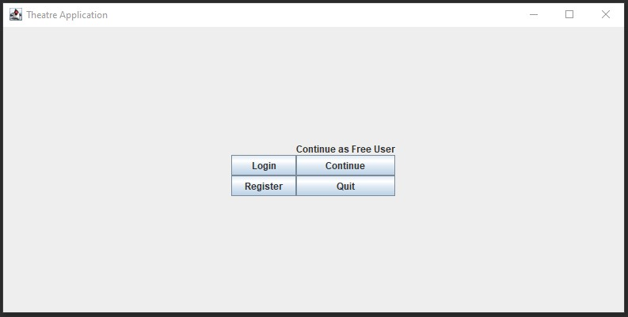
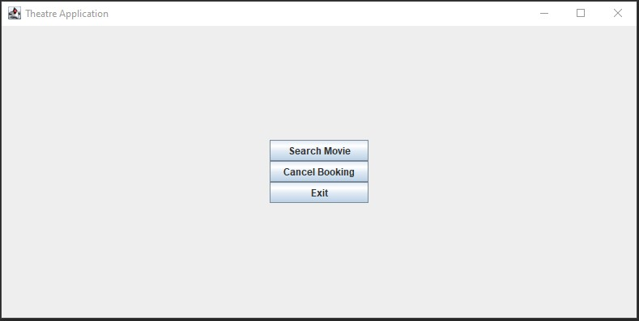
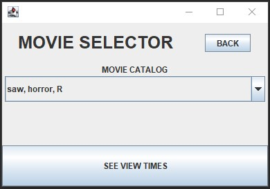
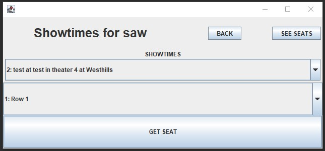
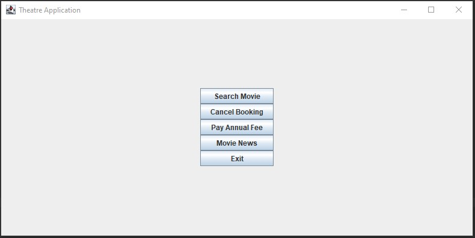
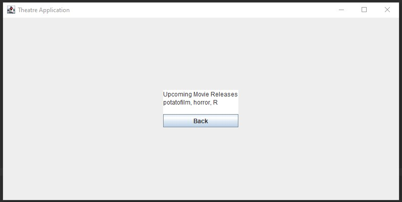

## ENSF 614 Term Project
A simple theater ticket app written in Java for the search and purchase of movie tickets from a given theater.\
App uses Java Swing for GUI and a dummy SQL database for all data storage, insertion, and deletion.\
MVC, singletons, and inheritance are utilized for the app's design.

App includes a login system differentiating between free users and registered users.\
Free users can immediately search for and purchase movie tickets, registered users must either login or register first.

Registered users have access to news on upcoming movies and do not need to pay a fee if cancelling their ticket.\
In exchange they must pay an annual fee.

